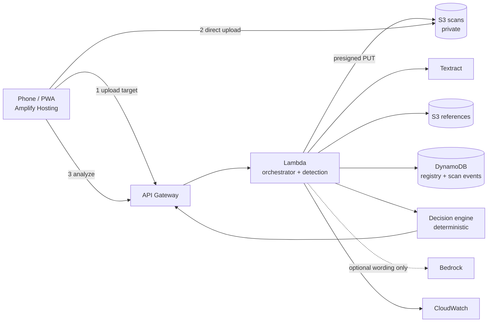

# SCADS — Supply-Chain-Aware Drug Screening

**A QR code tells you an identifier was issued. It cannot tell you the identifier is
on the pack it was issued for.**

Copy one real serial onto a thousand counterfeit packs and every one of them passes a
database check. SCADS asks a harder question: does this physical pack, carrying this
identity, make sense right now?

It compares three independent kinds of evidence and reports where they disagree.

| | Question | Caught by this alone |
|---|---|---|
| **Identity** | Was this code issued, and does it match the printed text? | An invented or revoked code |
| **Physical pack** | Does the printing match the enrolled artwork, region by region? | A poorly reproduced counterfeit |
| **Scan history** | Where else has this exact serial been seen, and when? | **A perfect copy of a real code** |

The third column is the point. A cloned serial on a flawless pack passes identity *and*
packaging. Only its behaviour over time gives it away.

---

## What it does, concretely

Scanning a demo pack whose serial was recorded in Delhi 58 minutes earlier, from
Bengaluru:

```text
Identity        VALID          0.96   unit serial matches an issued record
Physical pack   MATCH          0.87   layout, structure and print match the reference
Scan history    CONTRADICTION  0.10   same serial recorded 1,740 km away 58 minutes
                                      ago, implying 1,800 km/h

Decision        SUSPICIOUS
Because         IMPOSSIBLE_TRAVEL caps the result at 0.25 regardless of the rest
```

Those are the scores the system actually produces for this scan, not an illustration.

### Why not just average the three?

Because **under a weighted average, a dimension's maximum possible influence is its
weight.** History carries 0.25 here. So even a *certainly* impossible history — the same
unit serial in two cities within the hour — can move the result by at most a quarter,
from 0.93 down to 0.69. Averaged evidence cannot produce a suspicious verdict on the
strength of one dimension, no matter what that dimension observed.

Holding identity at 0.96 and packaging at 0.87, varying only history:

| History evidence | Weighted average | Geometric fusion |
|---|---|---|
| 1.00 clean | 0.934 | 0.932 |
| 0.50 unclear | 0.809 | 0.784 |
| 0.10 **contradicted** | **0.709** | **0.524** |
| 0.01 flatly impossible | 0.687 | 0.295 |

The average barely moves — 24% across the entire range. The geometric mean falls by 44%,
because in log space a near-zero input scales the whole product rather than contributing
a fixed share of a sum. The hard cap for `IMPOSSIBLE_TRAVEL` then takes the demo scan to
**0.25**, which is what makes it *suspicious* rather than merely uncertain.

That is the whole design: contradictions have to survive fusion, not get diluted by it.
[Tests assert these exact numbers](tests/unit/test_fusion.py).

---

## Safety boundary

A photograph cannot measure what is inside a pack. SCADS never says a medicine is
genuine or safe, and emits only four result classes:

`LOW_OBSERVED_RISK` · `REVIEW_REQUIRED` · `SUSPICIOUS` · `UNABLE_TO_VERIFY`

**A bad photo is not evidence of anything.** Blur, glare and darkness are measured
before any comparison runs. A capture too poor to judge returns `UNABLE_TO_VERIFY` with
advice on retaking it — never an accusation. Getting this backwards would mean telling
people their genuine medicine is fake because their kitchen is dim, and a
[contract test](tests/unit/test_contracts.py) asserts it across every scenario shape.

---

## Architecture



More detail, including the evidence pipeline and the averaging comparison, in
[`docs/assets/architecture.md`](docs/assets/architecture.md).

**The verdict is a pure function.** `decide(evidence) -> DecisionResult` performs no
I/O and has no clock. Bedrock, when enabled, receives the decision and the reason codes
and may only restyle the wording — it never sees the pack's OCR text (which is
attacker-controlled) and cannot change a finding. A Bedrock outage does not affect a
result.

### AWS services and why each is there

| Service | Role | Why |
|---|---|---|
| Amplify Hosting | Serves the client | The client is plain HTML/CSS/ES modules — no build to configure or break |
| API Gateway (HTTP API) | Public surface | Cheaper and lower-latency than REST API; throttling bounds abuse and spend |
| Lambda | Orchestration + detection | Scales to zero; 78 MB package deploys as a plain zip, no container |
| S3 | Scans and references | Direct presigned upload keeps images out of API Gateway and Lambda entirely |
| Textract | OCR words and boxes | `DetectDocumentText` only — SCADS needs word geometry, not forms |
| DynamoDB | Registry + scan events | On-demand; a GSI on `(serial, event_time)` makes the history check a bounded query |
| CloudWatch | Logs, metrics, alarms | Structured JSON logs with credentials, coordinates and OCR text redacted |
| Bedrock *(optional)* | Wording | Off by default. Never authoritative |

### Cost decisions

Serverless throughout, scaling to zero between demos. Uploads go phone → S3 directly,
so megabytes never traverse API Gateway or Lambda. DynamoDB is on-demand because demo
traffic is bursty and provisioned capacity would either throttle or bill for idle.
Scan images expire after 7 days. Logs retain for 14. Textract is **skipped** when the
quality gate has already rejected a capture — calling a per-page OCR service on a photo
known to be ungradeable spends money to learn nothing. No always-on compute, no GPU.

---

## Run it locally

No AWS account needed. Python 3.9+ only.

```bash
python3 -m venv .venv
.venv/bin/pip install "numpy<2.1" pillow boto3 pytest segno pyyaml

.venv/bin/python scripts/seed_demo.py     # registry, references, demo history, fixtures
.venv/bin/python scripts/dev_server.py    # http://localhost:8000
```

The dev server runs the **same Lambda handler code** the deployed stack runs, over
`http.server`, translating HTTP into API Gateway v2 events. A bug found locally is a bug
in the deployed path.

Open <http://localhost:8000> and try the demo packs, or run the scenarios headlessly:

```bash
.venv/bin/python scripts/smoke_test.py --base-url http://localhost:8000
```

### Tests

```bash
.venv/bin/python -m pytest tests/ -q                 # everything
.venv/bin/python -m pytest tests/ -q -m "not slow"   # skip image-pipeline tests
.venv/bin/python scripts/calibrate.py                # the evidence behind every threshold
.venv/bin/python scripts/secret_scan.py              # before publishing
```

---

## Deploy to AWS

```bash
export AWS_REGION=ap-south-1
.venv/bin/python scripts/deploy.py                   # stack, seed, smoke test
.venv/bin/python scripts/deploy_web.py --api-url https://...  # Amplify
```

`deploy.py` builds the Lambda package, uploads it, and applies a CloudFormation change
set — **without the AWS CLI or the SAM CLI**. CloudFormation runs the
`AWS::Serverless-2016-10-31` transform server-side, so `create_change_set` with
`CAPABILITY_AUTO_EXPAND` deploys a SAM template directly from boto3. Use `--plan` to
review changes before applying. After deploying, the smoke test runs with
`--expect-aws`, which **fails** unless the live API reports `s3` / `dynamodb` /
`textract` — a deployment quietly running on offline stubs cannot pass.

---

## Evaluation

Measured over a 21-fixture corpus with `scripts/calibrate.py`:

| Measurement | Result |
|---|---|
| Artwork tampers flagged by a physical reason code | 5 / 5 |
| Genuine packs false-flagged | 0 / 8 |
| Identity tampers correctly leaving packaging evidence clean | 3 / 3 |
| Difficult captures gated before comparison | 4 / 5 |
| Pipeline latency (median / max) | 451 ms / 524 ms |

**What these numbers are not.** The corpus is *synthetic* tampering: images perturbed in
controlled ways to measure which feature responds to which change. It is not a
counterfeit benchmark, and none of this supports a claim about detecting real
counterfeits. Every tampered fixture is labelled `synthetic_tamper`, never
"counterfeit". Thresholds were set from these measurements on one rendering pipeline;
they are not cross-device calibrated. See [`docs/EVALUATION.md`](docs/EVALUATION.md).

The aggregate physical score separates genuine from tampered by only **0.007** — which
is exactly why the architecture emits per-feature reason codes and the fusion policy
acts on those, rather than thresholding a single number.

---

## Limits worth stating plainly

- A photograph cannot measure active ingredient, dose, sterility or contamination.
- **Genuine packaging refilled with the wrong contents passes every check here.** This
  needs tamper-evident packaging, custody data or chemical testing.
- A cloned serial may go undetected until it is scanned somewhere else — history
  evidence needs history.
- Defocus and poor printing both reduce edge energy, and one image cannot separate them.
  SCADS handles this by refusing to judge print quality on a soft capture rather than
  guessing.
- A compromised enrollment source would let SCADS certify bad ground truth.
- Demo locations are **simulated**. Real location is never requested or stored.

[`docs/THREAT_MODEL.md`](docs/THREAT_MODEL.md) covers the adversaries and what remains
unsolved.

---

## Repository map

```text
packages/scads/scads/
  contracts/    enums, the 34-code reason registry, evidence models, record shapes
  decision/     versioned fusion policy, the pure decide(), deterministic explanation
  identity/     QR parsing (SCADS/GS1/JSON), normalisation, registry evaluation
  physical/     upload validation, quality gate, registration, comparison features
  history/      impossible travel, serial reuse, post-sale reuse, burst detection
  adapters/     S3/DynamoDB/Textract/Bedrock, plus offline equivalents
  api/          routing, validation, the scan orchestrator
  demo/         seed data, pack renderer, capture simulator, fixture corpus
apps/web/       the mobile client (no build step)
apps/api/       Lambda entry point
infra/          SAM template
scripts/        seed, calibrate, package, deploy, smoke test, secret scan
tests/          unit + integration, including the three demo scenarios
```

Design documents live in [`docs/`](docs/); implementation state and the decision log in
[`MEMORY.md`](MEMORY.md).

---

## Credits

Built for the WeMakeDevs × AWS Builder Center **First Commit** hackathon (Ship It track).

Research and regulatory context, with primary sources, is recorded in
[`docs/RESEARCH_NOTES.md`](docs/RESEARCH_NOTES.md) — including why this project uses
WHO's "1 in 10 medical products in low- and middle-income countries" framing rather
than the widely repeated but poorly sourced mortality figures.

Developed with AI assistance (Claude Code). All thresholds in this repository were set
from measurements produced by `scripts/calibrate.py`, not chosen by feel; the
measurements and their limits are stated above.

Dependencies: [numpy](https://numpy.org) (BSD-3), [Pillow](https://python-pillow.org)
(MIT-CMU), [boto3](https://github.com/boto/boto3) (Apache-2.0).
Development only: [pytest](https://pytest.org) (MIT), [segno](https://github.com/heuer/segno)
(BSD-3), [PyYAML](https://pyyaml.org) (MIT). The client uses no third-party JavaScript.
