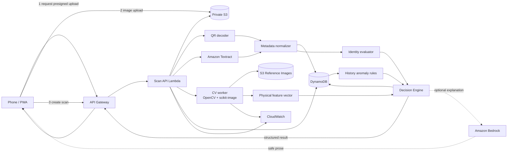
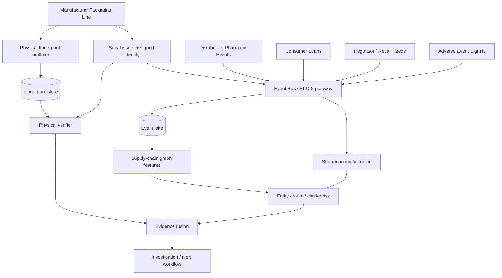

# SCADS Architecture

## 1. Architectural principles

1. **Evidence, not magic score.** Preserve individual signals and reason codes.
2. **Contradictions dominate averages.** Unknown/revoked/cloned identities cannot be washed out by a pretty image.
3. **Uncertainty is explicit.** Poor input yields `UNABLE_TO_VERIFY`.
4. **Event-first.** Every verification creates a scan event.
5. **Unit-first schema.** `serial -> batch -> SKU -> manufacturer`, with batch fallback.
6. **Auditable.** Store algorithm/policy/reference versions.
7. **Phone-first, cloud-backed.**
8. **AWS-native but not service-count driven.**
9. **Future-compatible with standard event interchange.**
10. **No chemical-authenticity claim from packaging evidence.**

---

## 2. Hackathon logical architecture



### Important correction from the initial concept

Bedrock is not the required OCR/authenticity engine.

For the core verdict:
- QR parsing is deterministic.
- Textract returns text/bounding boxes.
- CV computes deterministic features.
- DynamoDB provides registry/history.
- the decision engine is a pure function.

Bedrock can be used for:
- field normalization when OCR is ambiguous;
- safe explanation from already-decided reason codes;
- admin tooling.

If Bedrock fails, SCADS still verifies.

---

## 3. Request flow

### 3.1 Create upload

`POST /v1/uploads`

Backend validates:
- MIME allowlist;
- max size;
- expected scan id;
- authenticated admin-only fields not exposed.

Returns:
- `scan_id`;
- presigned S3 `PUT` URL;
- object key.

### 3.2 Upload image

Phone uploads directly to S3, reducing API Gateway/Lambda payload burden.

Object key example:

```text
scans/2026/09/18/{scan_id}/original.jpg
```

S3 stays private.

### 3.3 Start analysis

`POST /v1/scans/{scan_id}/analyze`

Input may include:
- parsed QR payload from client;
- optional coarse/demo location;
- explicit consent flags;
- product hint only if needed.

### 3.4 Extraction

Order:
1. decode QR if available;
2. verify payload schema/signature if supported;
3. call Textract when visible text is required;
4. normalize batch/lot/date/manufacturer;
5. cross-check QR claims against OCR-visible claims.

### 3.5 Registry lookup

Lookup in unit registry:
- serial;
- batch;
- SKU;
- manufacturer;
- status;
- reference profile version.

Fallback to batch-only mode if demo product has no serial.

### 3.6 Physical comparison

Before comparison:
1. quality gate;
2. detect package/ROI;
3. align to reference using feature matches/homography;
4. compute feature set only if alignment confidence passes.

Feature outputs include:
- text-content similarity;
- text-layout similarity;
- SSIM / structural similarity on stable ROIs;
- edge/sharpness statistics;
- optional color consistency;
- registration quality.

### 3.7 History analysis

Query prior events by serial.

Rules:
- serial reused;
- already decommissioned/sold then reused;
- impossible travel;
- excessive scan velocity;
- conflicting product/batch claims.

For demo, the minimum is duplicate + impossible travel.

### 3.8 Decision

Use `docs/SCORING_AND_DETECTION.md`.

The engine returns:
- dimensions;
- decision;
- trust presentation score;
- reason codes;
- next action;
- versions.

### 3.9 Explanation

Frontend maps reason codes to deterministic text.

Optional Bedrock prompt receives **only** structured outcome, never arbitrary authority:

```json
{
  "decision": "SUSPICIOUS",
  "reason_codes": ["SERIAL_REUSE", "IMPOSSIBLE_TRAVEL"],
  "dimensions": {"identity": 0.95, "physical": 0.91, "history": 0.18}
}
```

It may rewrite for readability, but it may not change the decision.

---

## 4. Sync vs async

### MVP
Prefer synchronous orchestration if end-to-end latency is acceptable.

### Fallback
If Textract/CV latency causes timeout:
- create scan => `PROCESSING`;
- S3 event or API call triggers Step Functions/Lambda;
- frontend polls `GET /v1/scans/{scan_id}` with bounded backoff.

Do not add Step Functions solely for architecture theatre.

---

## 5. CV compute placement

### Option A — Lambda container [preferred if stable]
Pros:
- scales to zero;
- strong Ship It fit;
- simple architecture.

Cons:
- cold start;
- image packages.

### Option B — App Runner microservice
Use if OpenCV Lambda packaging/latency becomes a blocker.

Pros:
- standard FastAPI/container model;
- straightforward native dependencies.

Cons:
- more moving parts/cost.

### Decision rule
Do not spend >1 focused debugging block fighting binary packaging. Move to App Runner if it protects delivery.

---

## 6. Reference enrollment

Hackathon enrollment can be CLI/admin-only.

For each product/package variant store:

```text
reference_profile_id
sku_id
packaging_variant
reference_version
reference_image_s3_key
stable_rois[]
ocr_anchors[]
expected_dimensions/aspect
feature_baselines
created_at
```

Use multiple genuine captures if available.

Never compare an arbitrary phone photo directly to an unregistered web product image and call the delta counterfeit evidence.

---

## 7. Future architecture



Future platform components can include:
- Kinesis/EventBridge;
- S3 data lake;
- Glue/Athena;
- OpenSearch;
- Neptune only if graph traversal requirements justify it;
- SageMaker for calibrated models;
- EPCIS adapters;
- regulator/manufacturer APIs.

Do not introduce these during the weekend unless the core path is already finished.

---

## 8. Failure semantics

| Failure | Result |
|---|---|
| Image too blurry/glared | `UNABLE_TO_VERIFY` |
| Unsupported SKU/reference missing | `UNABLE_TO_VERIFY` |
| Unknown serial but batch exists | `REVIEW_REQUIRED` or `SUSPICIOUS` per policy, never low-risk solely on image |
| Serial revoked | `SUSPICIOUS` |
| Perfect image + cloned serial | `SUSPICIOUS` |
| Valid identity + physical mismatch | `SUSPICIOUS` / `REVIEW_REQUIRED` |
| Expired authentic pack | authenticity dimensions can be high, `product_status=EXPIRED`; UI warns not to use |
| Bedrock unavailable | deterministic explanation fallback; core decision unaffected |

---

## 9. Architecture invariants

- No public S3 buckets.
- Consumer cannot enroll/update genuine references.
- Consumer cannot set unit status.
- Scan history is not destructively rewritten.
- Exact location is not required.
- All thresholds are versioned.
- Result always reports quality and evidence dimensions.
