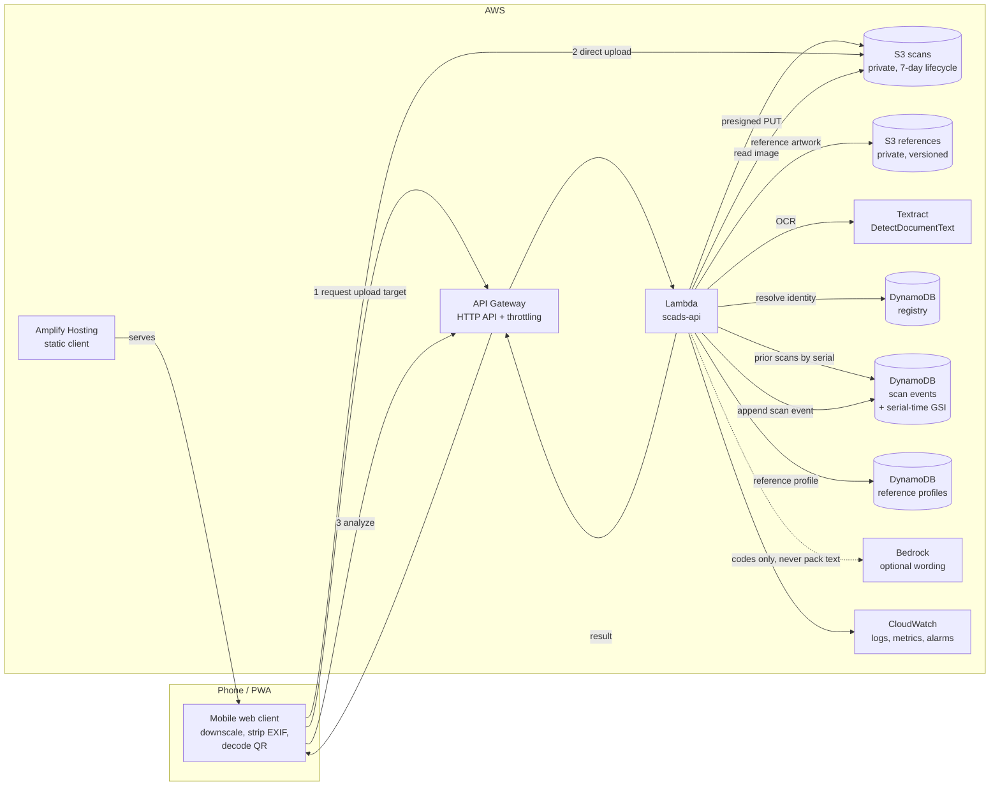
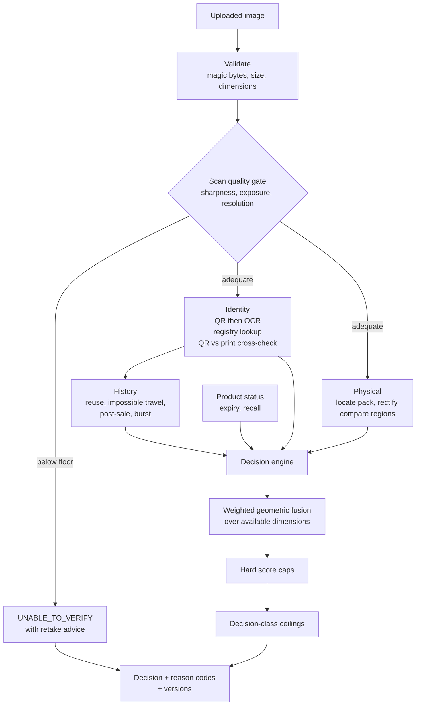
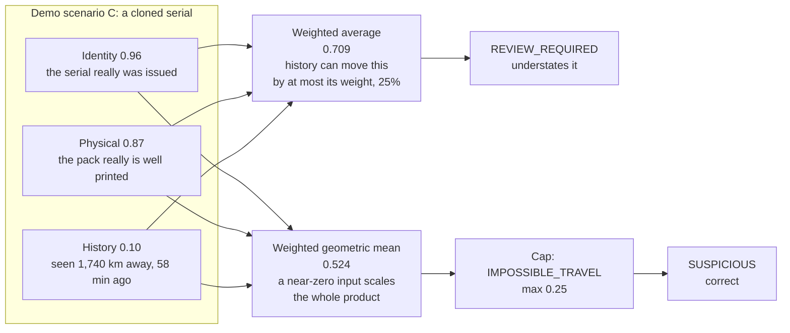

# SCADS architecture diagrams

Source for the diagrams in `README.md`. Rendered by GitHub automatically.

## Request path

## Evidence pipeline inside the Lambda

## Why the three dimensions cannot be averaged

